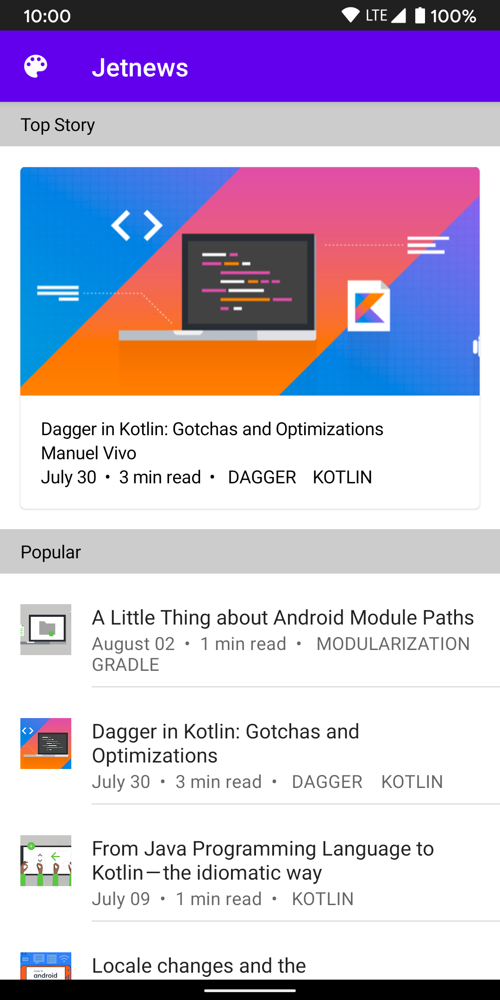
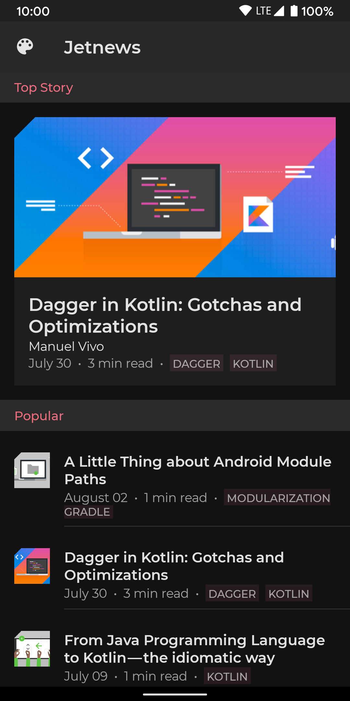

# [Jetpack Compose theming](https://developer.android.com/codelabs/jetpack-compose-theming?authuser=4&continue=https%3A%2F%2Fdeveloper.android.com%2Fcourses%2Fpathways%2Fcompose%3Fhl%3Den%26authuser%3D4%23codelab-https%3A%2F%2Fdeveloper.android.com%2Fcodelabs%2Fjetpack-compose-theming&hl=en#0)
> 이 코드랩에서는 Jetpack Compose의 테마 API를 사용하여 애플리케이션의 스타일을 지정하는 방법을 배웁니다.
Light, Dark 테마와 같은 여러 테마를 지원하여 애플리케이션 전체에서 일관되게 사용되도록 색상, 모양 및 타이포그래피를 사용자 지정하는 방법을 살펴보겠습니다.

**무엇을 배울 것인가**
- 머티리얼 디자인 입문서 및 브랜드에 맞게 사용자 정의하는 방법
- Compose가 머티리얼 디자인 시스템을 구현하는 방법
- 앱 전체에서 색상, 타이포그래피 및 모양을 정의하고 사용하는 방법
- 구성 요소 스타일 지정 방법
- Light, Dark 테마를 지원하는 방법

## 3. [Material Theming](https://material.io/design/introduction#principles)
> Jetpack Compose는 디지털 인터페이스를 만들기 위한 종합적인 디자인 시스템인 Material Design의 구현을 제공합니다.
머티리얼 디자인 구성 요소(버튼, 카드, 스위치 등)는 머티리얼 테마를 기반으로 구축되어 머티리얼 디자인을 사용자 지정하여 제품 브랜드를 더 잘 반영할 수 있는 체계적인 방법입니다.
머티리얼 테마는 색상, 타이포그래피 및 모양 속성으로 구성됩니다. 이를 사용자 정의하면 앱을 빌드하는 데 사용하는 구성 요소에 자동으로 반영됩니다.

## 4. Define your theme

### MaterialTheme
> Jetpack Compose에서 테마를 구현하기 위한 핵심 요소는 MaterialTheme composable입니다. \
  이 컴포저블을 작성 계층에 배치하면 그 안의 모든 구성 요소에 대한 색상, 유형 및 모양에 대한 사용자 정의를 지정할 수 있습니다.

```kotlin
@Composable
fun MaterialTheme(
    colors: Colors,
    typography: Typography,
    shapes: Shapes,
    content: @Composable () -> Unit
) { ...
```

### Create a Theme
> 스타일을 중앙 집중화하려면 MaterialTheme를 래핑하고 구성하는 자신만의 컴포저블을 만드는 것이 좋습니다. \
  이렇게 하면 테마 사용자 지정을 지정할 수 있는 단일 위치가 제공되며 여러 곳에서 쉽게 재사용할 수 있습니다. \
  여러 화면 또는 @Previews에서 예를 들어 앱의 여러 섹션에 대해 다른 스타일을 지원하려는 경우와 같이 필요한 경우 여러 테마 컴포저블을 만들 수 있습니다.

### [Colors](https://developer.android.com/reference/kotlin/androidx/compose/ui/graphics/Color.html?authuser=4)
> Compose의 색상은 Color 클래스를 사용하여 정의됩니다. 색상을 ULong으로 지정하거나 별도의 색상 채널로 지정할 수 있는 여러 생성자가 있습니다.

- 색상 지정을 위한 일반적인 '#dd0d3c' 형식에서 변환하려면 '#'을 '0xff', 즉 Color(0xffdd0d3c)로 바꾸십시오. 여기서 'ff'는 전체 알파를 의미합니다.

### [Typography](https://developer.android.com/reference/kotlin/androidx/compose/material/Typography?authuser=4)
> Compose에서 TextStyle 개체를 정의하여 일부 텍스트의 스타일을 지정하는 데 필요한 정보를 정의할 수 있습니다.

- [TextStyle](https://developer.android.com/reference/kotlin/androidx/compose/ui/text/TextStyle?authuser=4)

### Shapes
> 앱에서 모양을 사용하여 브랜드를 표현하고 싶습니다.

- Compose는 모양 테마를 정의하는 데 사용할 수 있는 [RoundedCornerShape](https://developer.android.com/reference/kotlin/androidx/compose/foundation/shape/RoundedCornerShape?authuser=4) 및 [CutCornerShape](https://developer.android.com/reference/kotlin/androidx/compose/foundation/shape/CutCornerShape?authuser=4) 클래스를 제공합니다.

### [Dark Theme](https://developer.android.com/guide/topics/ui/look-and-feel/darktheme?authuser=4)
> 앱에서 어두운 테마를 지원하면 앱이 사용자의 기기(Android 10부터 전역 어두운 테마 토글이 있음)에 더 잘 통합될 뿐만 아니라 전력 사용량을 줄이고 접근성 요구 사항을 지원할 수 있습니다.
Material은 [어두운 테마 생성에 대한 디자인 지침](https://material.io/design/color/dark-theme.html#usage)을 제공합니다.


## 5. Working with Color
> 앱의 색상, 유형 스타일 및 모양을 설정하기 위해 고유한 테마를 만드는 방법을 살펴보았습니다.
모든 Material 구성 요소는 이러한 사용자 정의를 기본적으로 사용합니다.
예를 들어 FloatingActionButton 컴포저블은 기본적으로 테마의 2차 색상을 사용하지만 이 매개변수에 다른 값을 지정하여 대체 색상을 설정할 수 있습니다.

```kotlin
@Composable
fun FloatingActionButton(
  backgroundColor: Color = MaterialTheme.colors.secondary,
  ...
) {
```

- Material Component 가 사용하는 테마 색상을 보는 것은 구성 요소의 기본 매개변수로 지정되기 때문에 View와 비교하여 Compose에서 크게 단순화됩니다. \
  [구성 요소의 선언](https://www.jetbrains.com/help/idea/navigating-through-the-source-code.html#go_to_declaration)으로 이동하여 이를 쉽게 확인할 수 있습니다.
- 항상 기본 설정을 사용하고 싶지는 않습니다. 이 섹션에서는 앱에서 색상으로 작업하는 방법을 보여줍니다.

### Theme Colors
> 보다 유연한 접근 방식은 테마에서 색상을 검색하는 것입니다.

```kotlin
Surface(color = MaterialTheme.colors.primary)
```

### Surface & Content colors
> 많은 구성 요소는 한 쌍의 색상 및 "콘텐츠 색상"을 허용합니다.

```kotlin
Surface(
  color: Color = MaterialTheme.colors.surface,
  contentColor: Color = contentColorFor(color),
  ...

TopAppBar(
  backgroundColor: Color = MaterialTheme.colors.primarySurface,
  contentColor: Color = contentColorFor(backgroundColor),
  ...
```

- [LocalContentColor](https://developer.android.com/reference/kotlin/androidx/compose/material/package-summary?authuser=4#LocalContentColor()) [CompositionLocal](https://developer.android.com/reference/kotlin/androidx/compose/runtime/CompositionLocal?authuser=4)을 사용하여 현재 배경과 대조되는 색상을 검색할 수 있습니다.

```kotlin
BottomNavigationItem(
  unselectedContentColor = LocalContentColor.current ...
```

### Content Alpha
> 종종 우리는 중요성을 전달하고 시각적 계층 구조를 제공하기 위해 콘텐츠를 강조하거나 강조하지 않으려고 합니다. Material Design에서는 이러한 다양한 중요도 수준을 전달하기 위해 다양한 불투명도 수준을 사용할 것을 권장합니다.

- [Text legibility](https://material.io/design/color/text-legibility.html#legibility-standards)
- Jetpack Compose는 LocalContentAlpha를 통해 이를 구현합니다. \
  이 CompositionLocal에 대한 값을 제공하여 계층에 대한 콘텐츠 알파를 지정할 수 있습니다. \
  자식 컴포저블은 이 값을 사용할 수 있습니다. 예를 들어 Text 및 Icon은 기본적으로 LocalContentAlpha를 사용하도록 조정된 LocalContentColor 조합을 사용합니다. \
  Material은 ContentAlpha 개체에 의해 모델링되는 일부 표준 알파 값(높음, 중간, 비활성화됨)을 지정합니다. \
  MaterialTheme는 LocalContentAlpha를 ContentAlpha.high로 기본 설정합니다.

- 여기에서는 colors 속성이 MaterialTheme 구성 요소에 설정된 Colors를 반환하는 MaterialTheme 객체를 사용하고 있습니다.
- 테마에 다른 색상 세트를 제공하기만 하면 다양한 모양과 느낌을 지원할 수 있으며 애플리케이션 코드를 건드릴 필요가 없습니다.

### Dark Theme
> Compose에서 어두운 테마를 구현하려면 테마를 통해 다양한 색상 세트와 쿼리 색상을 제공하기만 하면 됩니다.


## 6. Working with Text
> 텍스트로 작업할 때 텍스트 구성 가능을 사용하여 텍스트를 표시하고 텍스트 입력을 위해 TextField 및 OutlinedTextField를 사용하고 텍스트에 단일 스타일을 적용하기 위해 TextStyle을 사용합니다. \
  AnnotatedString을 사용하여 텍스트에 여러 스타일을 적용할 수 있습니다.

- 색상에서 보았듯이 텍스트를 표시하는 머티리얼 구성 요소는 테마 타이포그래피 사용자 정의를 선택합니다.

```kotlin
Button(...) {
  Text("This text will use MaterialTheme.typography.button style by default")
}
```

- 이를 달성하는 것은 색상에서 본 기본 매개변수를 사용하는 것보다 약간 더 복잡합니다. 이는 구성 요소가 텍스트 자체를 표시하지 않는 경향이 있기 때문입니다. \
  오히려 구성 요소가 텍스트 구성 가능을 전달할 수 있도록 하는 '슬롯 API'를 제공하기 때문입니다. \
  그렇다면 컴포넌트는 어떻게 테마 타이포그래피 스타일을 설정할까요? \
  내부적으로는 `ProvideTextStyle` composable(자체적으로 CompositionLocal을 사용함)을 사용하여 현재 TextStyle을 설정합니다. \
  구체적인 textStyle 매개변수를 제공하지 않으면 Text composable은 기본적으로 이 현재 스타일을 쿼리합니다.

```kotlin
@Composable
fun Button(
    // many other parameters
    text: @Composable RowScope.() -> Unit
) {
  ...
  ProvideTextStyle(MaterialTheme.typography.button) { //set the "current" text style
    ...
    text()
  }
}


@Composable
fun Text(
    // many, many parameters
    style: TextStyle = LocalTextStyle.current // get the value set by ProvideTextStyle
) { ...
```

**참고**
- [AnnotatedString](https://developer.android.com/reference/kotlin/androidx/compose/ui/text/AnnotatedString.html?authuser=4)

### Theme text styles
> 색상과 마찬가지로 현재 테마에서 TextStyles를 검색하여 작고 일관된 스타일 세트를 사용하고 유지 관리하기 쉽게 만드는 것이 가장 좋습니다. \
  MaterialTheme.typography는 MaterialTheme 컴포저블에 설정된 Typography 인스턴스를 검색하여 정의한 스타일을 사용할 수 있도록 합니다.

```kotlin
Text(
  style = MaterialTheme.typography.subtitle2
)
```

 -TextStyle을 사용자 정의해야 하는 경우 복사하고 속성을 재정의하거나(단지 데이터 클래스임) Text 구성 가능은 모든 TextStyle 위에 오버레이될 여러 스타일 매개변수를 허용합니다.
- 앱의 많은 위치에서 테마 TextStyles를 자동으로 적용합니다. 예를 들어 TopAppBar는 제목을 h6으로 스타일을 지정하고 ListItem은 기본 및 보조 텍스트를 subtitle1 및 body2에 각각 스타일 지정합니다.
- 테마 타이포그래피 스타일을 앱의 나머지 부분에 적용해 보겠습니다. 제목에 h6을 사용하고 작성자 및 메타데이터에 본문2를 사용하려면 FeaturedPost에서 subtitle2 및 텍스트를 사용하도록 헤더를 설정합니다.

### Multiple styles
> 일부 텍스트에 여러 스타일을 적용해야 하는 경우 AnnotatedString 클래스를 사용하여 텍스트 범위에 SpanStyles를 추가하여 마크업을 적용할 수 있습니다. 동적으로 추가하거나 DSL 구문을 사용하여 콘텐츠를 만들 수 있습니다.

```kotlin
val text = buildAnnotatedString {
  append("This is some unstyled text\n")
  withStyle(SpanStyle(color = Color.Red)) {
    append("Red text\n")
  }
  withStyle(SpanStyle(fontSize = 24.sp)) {
    append("Large text")
  }
}
```


## 7. Working with Shapes
> 색상 및 타이포그래피와 마찬가지로 모양 테마를 설정하면 Material 구성 요소에 반영됩니다.

- 예를 들어 Button은 작은 구성 요소에 대해 설정된 모양을 선택합니다.

```kotlin
@Composable
fun Button( ...
  shape: Shape = MaterialTheme.shapes.small
) {
```

- 색상과 마찬가지로 Material 구성 요소는 기본 매개변수를 사용하므로 구성 요소가 사용할 모양 범주를 확인하거나 대안을 제공하는 것이 간단합니다. 모양 범주에 대한 구성 요소의 전체 매핑은 [설명서](https://material.io/design/shape/applying-shape-to-ui.html#shape-scheme)를 참조하십시오.

- 일부 구성 요소는 컨텍스트에 맞게 수정된 테마 모양을 사용합니다. 예를 들어 기본적으로 TextField는 작은 모양 테마를 사용하지만 아래쪽 모서리에는 모서리 크기가 0으로 적용됩니다.

```kotlin
@Composable
fun FilledTextField(
  // other parameters
  shape: Shape = MaterialTheme.shapes.small.copy(
    bottomStart = ZeroCornerSize, // overrides small theme style
    bottomEnd = ZeroCornerSize // overrides small theme style
  )
) {
```

### Theme shapes
> 물론 모양을 허용하는 컴포저블 또는 수정자를 사용하여 고유한 구성 요소를 만들 때 모양을 직접 사용할 수 있습니다. \
  Surface, Modifier.clip, Modifier.background, Modifier.border 등

```kotlin
@Composable
fun UserProfile(
  ...
  shape: Shape = MaterialTheme.shapes.medium
) {
  Surface(shape = shape) {
    ...
  }
}
```

**참고**
- [Surface](https://developer.android.com/reference/kotlin/androidx/compose/material/package-summary?authuser=4#Surface(androidx.compose.ui.Modifier,androidx.compose.ui.graphics.Shape,androidx.compose.ui.graphics.Color,androidx.compose.ui.graphics.Color,androidx.compose.foundation.BorderStroke,androidx.compose.ui.unit.Dp,kotlin.Function0))
- [Modifier.clip](https://developer.android.com/reference/kotlin/androidx/compose/ui/draw/package-summary?authuser=4#clip(androidx.compose.ui.Modifier,androidx.compose.ui.graphics.Shape))


## 8. Component Styles
> Compose는 Android 보기 스타일 또는 CSS 스타일과 같은 구성 요소의 스타일을 추출하는 명시적인 방법을 제공하지 않습니다. \
  모든 Compose 구성 요소는 Kotlin으로 작성되므로 동일한 목표를 달성하는 다른 방법이 있습니다. \
  대신 사용자 지정 구성 요소의 자체 라이브러리를 만들고 앱 전체에서 사용하십시오.

- 우리는 모든 구성 요소가 더 낮은 수준의 구성 요소로 구성되어 있음을 확인했습니다. 동일한 구성 요소를 사용하여 재료 구성 요소를 사용자 지정할 수 있습니다.
- 예를 들어 Button은 전달된 콘텐츠의 기본 텍스트 스타일을 설정하기 위해 `ProvideTextStyle` composable을 사용하는 것을 보았습니다. 똑같은 메커니즘을 사용하여 자신만의 텍스트 스타일을 설정할 수 있습니다.

```kotlin
@Composable
fun LoginButton(
    onClick: () -> Unit,
    modifier: Modifier = Modifier,
    content: @Composable RowScope.() -> Unit
) {
    Button(
        colors = ButtonConstants.defaultButtonColors(
            backgroundColor = MaterialTheme.colors.secondary
        ),
        onClick = onClick,
        modifier = modifier
    ) {
        ProvideTextStyle(...) { // set our own text style
            content()
        }
    }
}
```

- 이 예제에서는 표준 Button 클래스를 래핑하여 LoginButton의 "스타일"을 만들고 다른 backgroundColor 및 텍스트 스타일과 같은 특정 속성을 지정합니다.

- 라이브러리 구성 요소를 래핑하고 사용자 지정하는 고유한 구성 요소를 만들어 이를 달성할 수 있습니다.
- 예를 들어 앱 전체에서 모든 버튼의 모양을 사용자 지정하고 싶지만 다른(비 버튼) 구성 요소에 영향을 미칠 수 있는 shapes.small 테마를 변경하고 싶지 않다고 가정해 보겠습니다.

```kotlin
@Composable
fun AcmeButton(
  // expose Button params consumers should be able to change
) {
  val acmeButtonShape: Shape = ...
  Button(
    shape = acmeButtonShape,
    // other params
  )
}
```


# ComposeFest2021
2021 DevFest ComposeFest 코드랩 Repo 입니다
본 폴더를 Android Studio를 이용해서 열어주세요.
작업을 완료하고, push 해주세요.

# Jetpack Compose Theming Codelab

This folder contains the source code for the [Jetpack Compose Theming codelab](https://developer.android.com/codelabs/jetpack-compose-theming).

In this codelab you will learn how to use [Jetpack Compose](https://developer.android.com/jetpack/compose)’s theming APIs to style your application. We’ll see how to customize colors, shapes and typography so that they’re used consistently throughout your application, supporting multiple themes such as light & dark theme.

## Screenshots





## License

```
Copyright 2020 The Android Open Source Project

Licensed under the Apache License, Version 2.0 (the "License");
you may not use this file except in compliance with the License.
You may obtain a copy of the License at

    https://www.apache.org/licenses/LICENSE-2.0

Unless required by applicable law or agreed to in writing, software
distributed under the License is distributed on an "AS IS" BASIS,
WITHOUT WARRANTIES OR CONDITIONS OF ANY KIND, either express or implied.
See the License for the specific language governing permissions and
limitations under the License.
```
